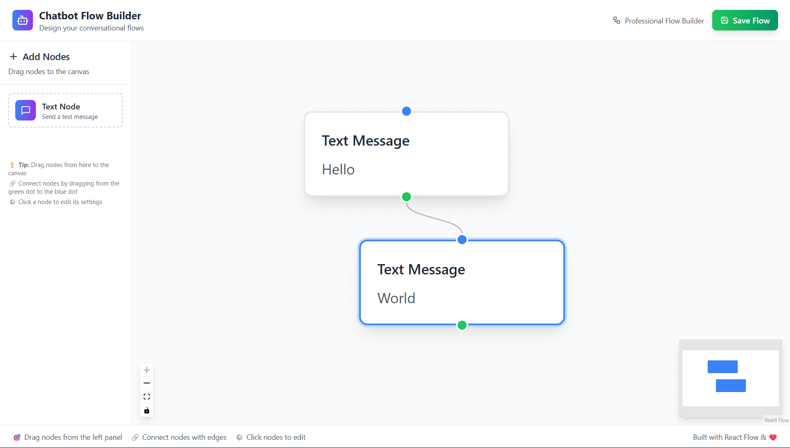

# 🤖 Chatbot Flow Builder

A professional-grade, drag-and-drop chatbot flow builder built with React and React Flow. Create conversational flows with an intuitive interface similar to modern design tools.

## 🚀 Live Demo

🔗 **[View Live Demo](https://flow-builder-kohl.vercel.app/)**

## ✨ Features

### Core Functionality
- **📱 Text Nodes**: Create and edit text message nodes
- **🎯 Drag & Drop**: Intuitive node placement from sidebar panel
- **🔗 Smart Connections**: Connect nodes with validation rules
- **⚙️ Dynamic Settings**: Edit node content with right sidebar panel
- **💾 Flow Validation**: Comprehensive save validation with error handling
- **📱 Responsive Design**: Works beautifully on all device sizes

### Advanced Features
- **🎨 Modern UI**: Beautiful gradient-based design with smooth animations
- **🔍 Mini Map**: Navigate large flows easily
- **⌨️ Keyboard Shortcuts**: Zoom, pan, and reset viewport controls
- **🎯 Visual Feedback**: Hover states, selection indicators, and transitions
- **📊 Flow Analytics**: Node and connection counting
- **🛡️ TypeScript**: Full type safety throughout the application

## 🛠️ Tech Stack

- **Framework**: React 18 with TypeScript
- **Flow Engine**: React Flow (@xyflow/react)
- **State Management**: Zustand
- **Styling**: Tailwind CSS
- **UI Components**: shadcn/ui
- **Icons**: Lucide React
- **Build Tool**: Vite
- **Deployment**: Vercel

## 🏗️ Architecture

### Folder Structure
```
src/
├── components/
│   ├── FlowCanvas.tsx      # Main React Flow canvas
│   ├── TextNode.tsx        # Custom text node component
│   ├── NodePanel.tsx       # Left sidebar for dragging nodes
│   ├── SettingsPanel.tsx   # Right sidebar for editing
│   └── SaveButton.tsx      # Save and validation logic
├── store/
│   └── useFlowStore.ts     # Zustand state management
├── utils/
│   └── validateFlow.ts     # Flow validation logic
├── types/
│   └── index.ts           # TypeScript type definitions
└── App.tsx                # Main layout component
```

### Key Design Patterns
- **Component Composition**: Modular, reusable components
- **Custom Hooks**: Centralized state management with Zustand
- **Type Safety**: Comprehensive TypeScript interfaces
- **Validation Logic**: Separated business rules for easy testing
- **Responsive Design**: Mobile-first approach with Tailwind

## 🎯 Validation Rules

The flow builder enforces these rules for valid chatbot flows:

1. **Single Entry Point**: Flows should have one starting node (recommended)
2. **Single Exit Point**: Flows must have exactly one ending node
3. **Connection Rules**: 
   - One outgoing connection per source handle
   - Multiple incoming connections allowed per target handle
4. **Message Validation**: Warns about empty message content

## 🚀 Getting Started

### Prerequisites
- Node.js 18+ 
- npm or yarn

### Installation

1. **Clone the repository**
   ```bash
   git clone <your-repo-url>
   cd chatbot-flow-builder
   ```

2. **Install dependencies**
   ```bash
   npm install
   ```

3. **Start development server**
   ```bash
   npm run dev
   ```

4. **Open in browser**
   ```
   http://localhost:5173
   ```

### Building for Production
```bash
npm run build
npm run preview
```

## 🎮 How to Use

1. **Add Nodes**: Drag the "Text Node" from the left panel onto the canvas
2. **Connect Nodes**: Drag from the green dot (source) to blue dot (target) on other nodes
3. **Edit Content**: Click any node to open the settings panel and edit the message
4. **Save Flow**: Click "Save Flow" to validate and save your chatbot flow
5. **Navigate**: Use the mini-map and controls to navigate large flows

## 🎨 Design Philosophy

This flow builder prioritizes:
- **User Experience**: Intuitive drag-and-drop interactions
- **Visual Hierarchy**: Clear distinction between different UI elements  
- **Accessibility**: Proper contrast ratios and keyboard navigation
- **Performance**: Optimized React Flow setup with proper state management
- **Extensibility**: Clean architecture for adding new node types

## 🔧 Customization

### Adding New Node Types

1. **Define the type in `src/types/index.ts`**
2. **Create the component in `src/components/`**
3. **Register it in `FlowCanvas.tsx` nodeTypes**
4. **Add it to `NodePanel.tsx` for dragging**

### Styling Customization

The app uses Tailwind CSS with a modern gradient-based design system. Key design tokens:

- **Primary**: Blue to Purple gradient (`from-blue-500 to-purple-600`)
- **Success**: Green to Emerald gradient (`from-green-500 to-emerald-600`)
- **Background**: Light gray (`bg-gray-50`)
- **Cards**: White with subtle shadows

## 📈 Performance Optimizations

- **React.memo**: Prevents unnecessary re-renders of nodes
- **useCallback**: Optimized event handlers
- **Zustand**: Minimal re-renders with targeted subscriptions
- **Code Splitting**: Lazy loading for optimal bundle size

## 🤝 Contributing

1. Fork the repository
2. Create a feature branch (`git checkout -b feature/amazing-feature`)
3. Commit changes (`git commit -m 'Add amazing feature'`)
4. Push to branch (`git push origin feature/amazing-feature`)
5. Open a Pull Request

## 📝 License

This project is licensed under the MIT License - see the [LICENSE](LICENSE) file for details.

## 🙏 Acknowledgments

- **React Flow Team** for the excellent flow library
- **shadcn/ui** for beautiful UI components
- **Tailwind CSS** for rapid styling
- **Lucide** for clean, consistent icons

---

**Built with ❤️ and modern web technologies**
